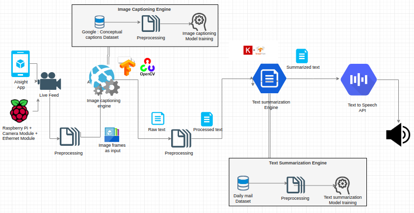

# **AIsight**
Helping you see the world!

### **How does AIsight work?**
AIsight describes the ongoing events captured through camera. This will help visually impaired people know about their surroundings and better equip them with details.

#### **Audience**
People with Visual Impairment / Blindness

# **Abstract**
How do you help your visually impaired friends see the world? We propose a solution - AISight, which acts as an all-time companion by describing the events happening in your surroundings.
AIsight is a virtual companion which will describe what is in front of you(audience being visually impaired people).

For instance,

Let's assume a visually impaired person is walking on a street, and wants to know what's in the surroundings, AISight will process the live video and describe what is going on at that moment in front of the person.

**Logical Steps of the Proposed solution:**

1. When the user scans the surroundings using camera, it is taken as an input.
2. Image Captioning engine will then generate a caption for an image frame of the video after every few frames repeatedly.
3. These multiple captions will be summarized by Text summarization engine.
4. The obtained caption is converted to speech by TextToSpeech Engine.
5. Eventually, it gives you a spoken description of surroundings.	

# **Architecture Diagram**

# **Market Research**

We are in a discussion with a few organizations namely, **LightHouse: For the Blind and Visually Impaired** and **Vision - Beyond sight** ,to validate the project idea, design, usability, scope and incorporating newer suggestions as mentioned by them. 

# **Technology Stack**

* **Android / Raspberry Pi**
We are yet to finalize the client end device (Android App or Raspberry Pi based device) to mount the backend logicbase based on the suggestions with 'LightHouse: For the Blind and Visually Impaired' Organization.

* **OpenCV**
Image preprocessing will be done using OpenCV.

* **Tensorflow**
Tensorflow / Tensorflow Lite will be used in Image captioning engine as well as Text summarization engine.

* **NLTK / Gensim**
These Natural language processing libraries will be used for text preprocessing.

* **Keras**
Keras will be used in the Text summarization because of its rich feature set along with Tensorflow.

* **GoogleTextToSpeechAPI**
This Library will be used to convert Text to Speech as the final output.
