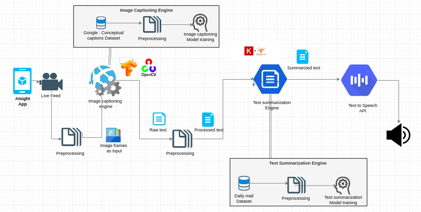

# **AIsight**

### **Problem Statement**
How do you help your visually impaired friends see the world? We propose a solution - an Android App which acts as an all-time companion by describing the events happening in your surroundings.

### **How does AIsight work?**
AIsight describes the ongoing events captured through camera. This will help visually impaired people know about their surroundings and better equip them with details.

#### **Audience**
People with Visual Impairment / Blindness

# **Abstract**

AIsight app will work as a virtual companion which will describe blind people what is in front of them. Basically it describes a live video or any video for that matter -

For eg.

A blind person is walking on a street, the app accessing the rear camera will process the live video and describe what is going on at that moment in front of him.

**Logical Steps of Proposed solution:**

1. When the user scans the surroundings using camera, it is taken as an input.
2. Image Captioning engine will then generate a caption for an image frame of the video after every few frames repeatedly.
3. These multiple captions will be summarized by Text summarization engine.
4. The obtained caption is converted to speech by TextToSpeech Engine.
5. Eventually, it gives you a spoken description of surroundings.	

# **Architecture Diagram**

# **Technology Stack**

* Tensorflow
* Keras
* OpenCV
* NLTK
* Gensim
* Android
* GoogleTextToSpeechAPI
