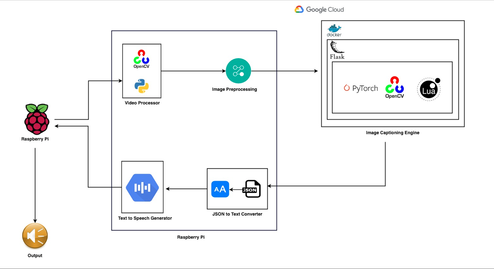

# **AIsight**
Helping you see the world!

### **How does AIsight work?**
AIsight describes the ongoing events captured through camera. This will help visually impaired people know about their surroundings and better equip them with details.

### **Who is AISight for?**
People with Visual Impairment / Blindness

### **Abstract**
How do you help your visually impaired friends see the world? We propose a solution - AISight, which acts as an all-time companion by describing the events happening in your surroundings.
AIsight is a virtual companion which will describe what is in front of you(audience being visually impaired people).

For instance,
Let's assume a visually impaired person is walking on a street, and wants to know what's in the surroundings, AISight will process the live video and describe what is going on at that moment in front of the person.

### **Why Us?**
There are applications in market which identify the objects in the surroundings but what makes us different is the scene description which will help the person understand the surroundings better in real time. We will try to achieve a near real time audio description from the streaming video.

### **Logical Steps of the Proposed solution:**

1. When the user scans the surroundings using Raspberrypi, image frames are sent to Image Captioning Engine on the server.
2. Image Captioning Engine will then repeatedly generate a caption for every image frame and sends it back to the Raspberrypi.
4. The obtained caption is then converted to speech by Pico2wave on Raspberrypi.
5. Eventually, it gives you a spoken description of surroundings.	

### **Architecture Diagram**

### **Market Research**

We are in a discussion with a few organizations namely, **LightHouse: For the Blind and Visually Impaired** and **Vision - Beyond sight** ,to validate the project idea, design, usability, scope and incorporating newer suggestions as mentioned by them. 

### **Technology Stack**

* **Raspberry Pi**
Rspberry Pi 3 is used to capture images and send it to flask server running on cloud. It receives the text generated in cloud and gives speech as output. 

* **OpenCV**
Machine Leaning model uses OpenCV for image processing.

* **Flask**
Server uses flask framework.

* **Lua, Torch**
The pre-trained Machine Learning model is written in Lua and uses torch.

* **Pico2wave**
Text-to-speech conversion is done on raspberrypi using Pico2wave

* **Docker**
Machine learning model which takes image as input and generates text is Dockerised and runs on GCP. 

* **Google Cloud Platform**
It is the cloud service which hosts server side code for AISight.

### **Team**

* Mihir Patel 
* Nishit Doshi
* Jainish Parikh
* Apoorva Banubakode

